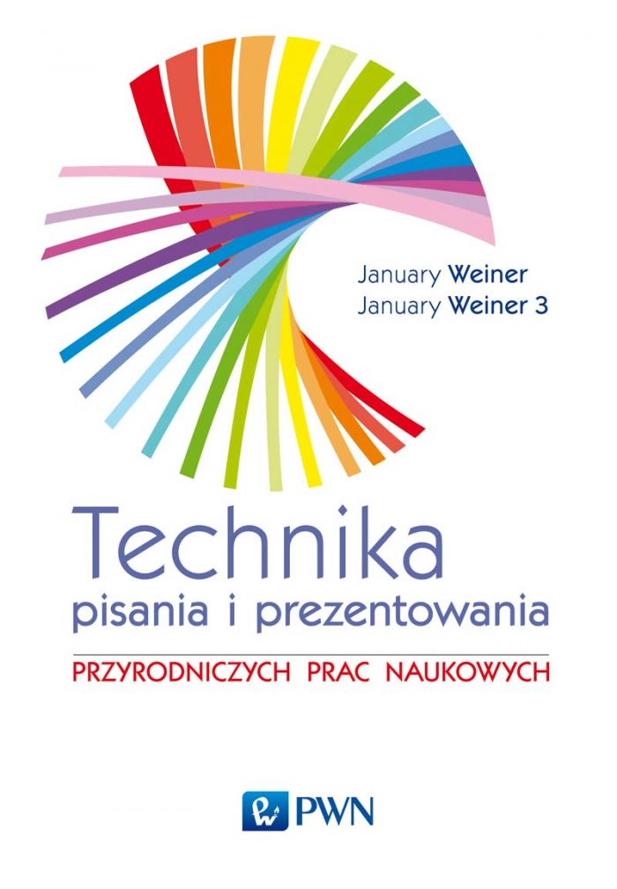
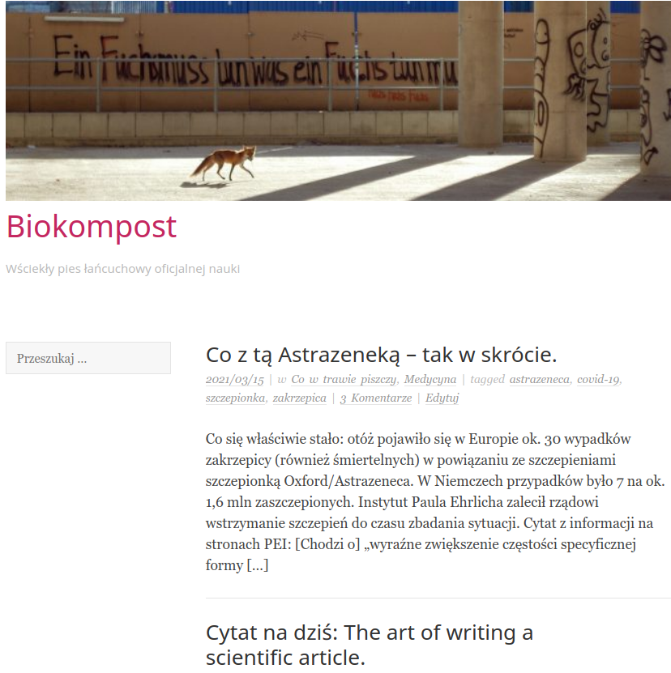
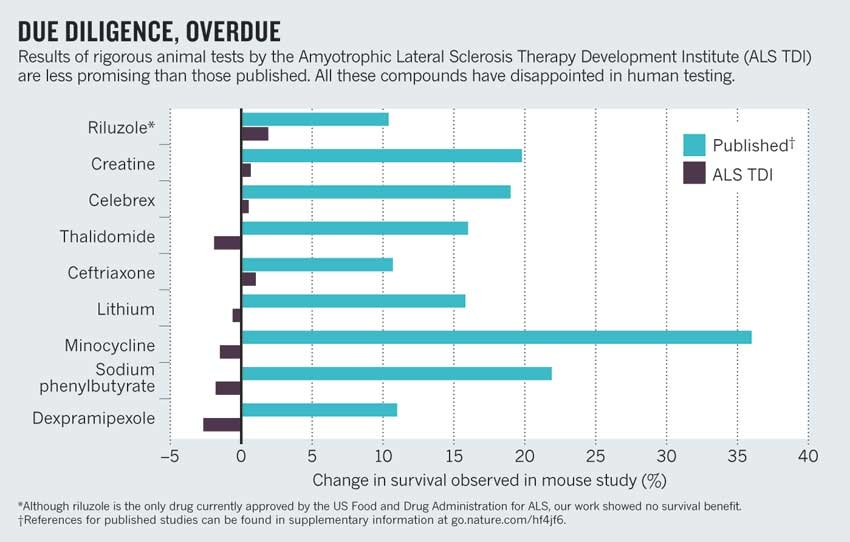
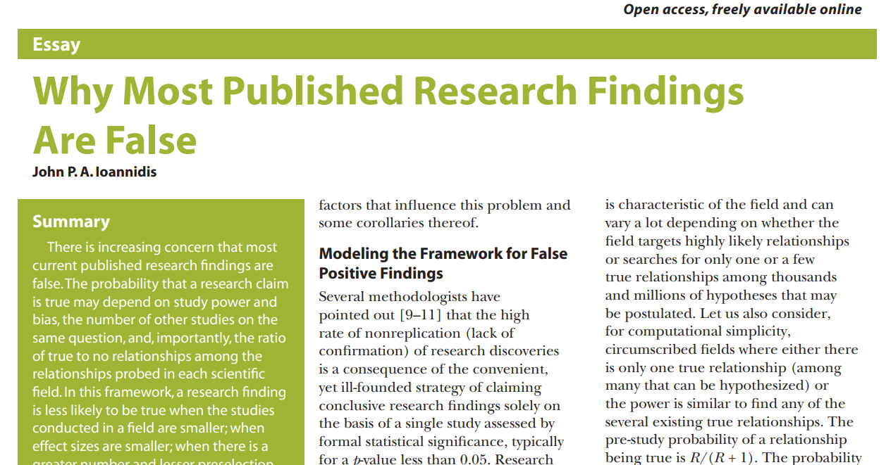
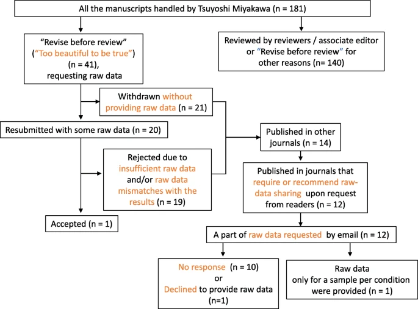

```{r,echo=FALSE}
## Set default options for the knitr RMD processing
knitr::opts_chunk$set(echo=FALSE,warning=FALSE,message=FALSE,fig.width=5,fig.height=5,cache=FALSE,autodep=TRUE, results="hide")
library(pander)
library(knitr)
library(kableExtra)
```

```{r echo=FALSE,include=FALSE,eval=TRUE}
options(crayon.enabled = TRUE)
options(crayon.colors = 256)
knitr::knit_hooks$set(output = function(x, options){
  paste0(
    '<pre class="r-output"><code>',
    fansi::sgr_to_html(x = htmltools::htmlEscape(x), warn = FALSE),
    '</code></pre>'
  )
})

## this is an ugly, ugly hack, but otherwise crayon does not LISTEN TO REASON!!!
num_colors <- function(forget=TRUE) 256
library(crayon)
assignInNamespace("num_colors", num_colors, pos="package:crayon")
```


```{r libraries,cache=FALSE}
library(tidyverse)
```

## Berlin Institute of Health

.pull-left[

 * Institute for translational and precision medicine

 * Founded in 2013 by Max Delbrück Center for
   Molecular Medicine and Charité – a university hospital affiliated with
   both Humboldt University and Free University Berlin.

 * Since 2020 a part of the Charité

]


???

Charité – over 15,000 employes


---

## A few words about myself

.pull-left[

Short bio:

 * PhD in molecular biology 
 * 2003-2009 evolutionary bioinformatics (sequence analyses, phylogeny, teaching)
 * 2009-2019 Max Planck for Infection Biology – tuberculosis, Omics, statistics, clinical trials
 * Since 2019 at the Core Unit for Bioinformatics, BIH, Charité

Areas of expertise:

 * biostatistics, R, "bioinformatics"¹
 * functional analysis
 * evolutionary biology
]

.myfootnote[
¹ Molecular biologists were so stunned at the idea of using statistics and
computers in research that they invented a new word for it.
]

--

.pull-right[



]

---

## A few words about myself

.pull-left[

Short bio:

 * PhD in molecular biology 
 * 2003-2009 evolutionary bioinformatics (sequence analyses, phylogeny, teaching)
 * 2009-2019 Max Planck for Infection Biology – tuberculosis, Omics, statistics, clinical trials
 * Since 2019 at the Core Unit for Bioinformatics, BIH, Charité

Areas of expertise:

 * biostatistics, R, "bioinformatics"¹
 * functional analysis
 * evolutionary biology
]

.myfootnote[
¹ Molecular biologists were so stunned at the idea of using statistics and
computers in research that they invented a new word for it.
]

.pull-right[



[Biokompost](https://biokompost.wordpress.com)

]

---

## Organisatory matters

 * Course materials repository: [https://github.com/january3/FunctionalTranscriptomics](https://github.com/january3/FunctionalTranscriptomics)

--

 * Direct access to lectures (HTML): [https://january3.github.io/FunctionalTranscriptomics/](https://january3.github.io/FunctionalTranscriptomics/)

--

 * Getting credit for this course: you will have to send me a reproducible
   analysis (Rmarkdown or Jupyter notebook or a similar system) and the
   corresponding analysis files (not PDF or HTML!). I will have to be able
   to run it / view it. You will receive the homework during the second
   Workshop session and you will have two weeks to complete it. 

--

It won't be hard.


--

 * Please ask questions.

--

 * **Please do *ask* questions.**

---

## What this course is about

 * Functional analyses in transcriptomics
 * Reproducibility in science
    * Using R to take care of a *small bit* of a larger issue
 * Jump-starting on R/Rstudio


---

## Reproducibility crisis in science


.myfootnote[
*Fanelli D. Opinion: Is science really facing a reproducibility crisis, and
do we need it to?. Proceedings of the National Academy of Sciences. 2018
Mar 13;115(11):2628-31.*
]

---

## Reproducibility crisis in science


.myfootnote[
*Open Science Collaboration. "Estimating the reproducibility of
psychological science." Science 349.6251 (2015).*
]

---

## Reproducibility crisis in science



.myfootnote[
*Perrin, Steve. "Preclinical research: Make mouse studies work." Nature
News 507.7493 (2014): 423.*
]

---

## Reproducibility crisis in science



.myfootnote[
*Ioannidis JP. Why most published research findings are false. PLoS medicine. 2005 Aug 30;2(8):e124.*
]

---

## Reasons for the reproducibility crisis: Lack of transparcency

.pull-left[

]

.pull-right[
"*We requested just the images of western blotting membranes and I wonder
how such images can contain novel information that is worth being kept
confidential.*"
]


.myfootnote[
*Miyakawa, Tsuyoshi. "No raw data, no science: another possible source of
the reproducibility crisis." (2020). Molecular Brain 13:24.*
]

---

## Reasons for the reproducibility crisis: Lack of transparcency

 * no precise description of methods:

```
We used generalized linear models (R package nlme4) to test the
significance of association.
```

Fine, but how exactly was the model formulated? How many covariates? What
transformations? What data were used? Which function? Were the results
corrected for multiple testing? Etc., etc., etc.

---

## What you will learn here and how that will help

.pull-left[

]

.pull-right[

 * Functional analysis of transcriptomic data

 * Writing reproducible and communicative analyses

 * Using markdown for your everyday needs
 
 * Tools for transparent and reproducible research (git, github, pipelines, containers)

 * Get a jump start on R – which makes reproducible research much easier
   and is a great statistical analysis language

]


---

## Why learn reproducible science with R?

 * Easy to document your statistical procedures

--

 * Fast lane from data to publication

--

 * Even if you barely use R, Rstudio is a great interface for editing
   (R)markdown files and github.

--

 * Harder to hide harking, p-hacking and file drawer

--

 * You can use it with Python, too

--

 * One way or the other, you will have to learn it or something similar

---

## Alternative: Jupyter Notebook

 * Python-oriented, but you can also use it with R

 * I find it harder to set up and use

 * No git interface

 * Not really an IDE (integrated development environment)

 * Less statistical analysis oriented, more flexible

---

## Why learn R?

.pull-left[

#### Pro

 * Massive amount of tools for statistics and specifically bioinformatics

 * Easy to get help

 * Even if you use Python, you will have to learn R (or you will work much
   more efficiently if you know R)

 * Nice if you like functional languages

 * R shiny allows creating server-based interactive apps

 * Learning statistics is *way* harder than learning R


]

--

.pull-right[

#### Con

 * Messy, bottom-up development with many quirks and inconsistencies

 * Many "dialects" (base R, tidyverse, Bioconductor...)

 * Functional languages are not intuitive if you come from a different
   programming background

]

---

## Python vs R

.pull-left[


### Python

 * flexible
 * general programming language
 * deep learning algorithms
 * you can use R from Python

]

.pull-right[

### R
 
 * statistics
 * data visualizations
 * interactive data exploration
 * you can use Python from R

]

--

**You probably will have to learn both, at least the basics.**

---

## Course plan

 * Workshop session 1: setting up our working environment
   
    * Introduction to R / Rstudio

    * Introduction to (R)markdown

    * Introduction to git / github

    * Very basic crash-course like introduction to R

    * Introduction to high-throughput data analysis, transcriptomics

    * Running a basic data analysis in transcriptomics

    * Introduction to the problems of functional analysis

---

## Course plan


 * Workshop session 2: functional analysis of transcriptomic data

    * Introduction to clustering a.k.a. unsupervised machine learning

    * Clustering genes 

    * Introduction to gene set enrichments

    * Gene set enrichment analysis


---

## Course plan

 * Lecture: Statistical analyses in times of reproducibility crisis

 * Lecture: Gene set enrichment algorithms – an overview


---

## The R language

.pull-left[

 * Interpreted language
 * Functional language: everything is a function
 * Pass by value 
 * Lazy evaluation
 * Four main types of objects:
    * Vectors
    * Matrices / Arrays
    * Lists
    * Functions

]

--

.pull-right[

**Functional language features:**

 * Minimization of side effects
 * Closures (anonymous functions, like lambda in Python)
 * Apply / map instead of loops

]

---

## Introduction to R/Rstudio


