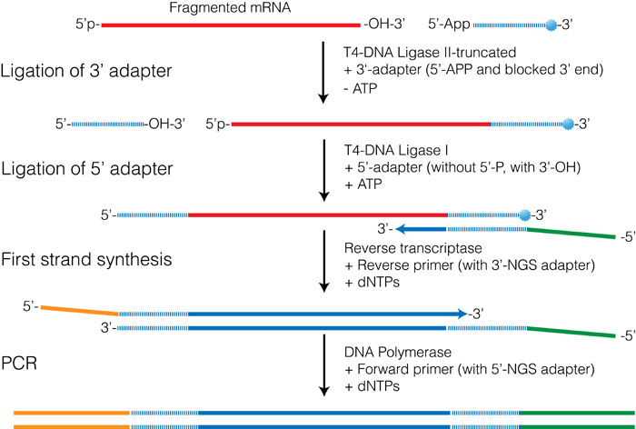
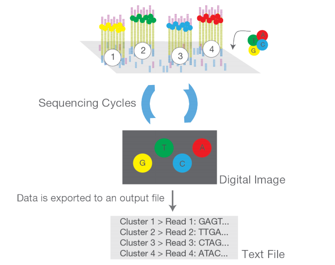

```{r,echo=FALSE}
## Set default options for the knitr RMD processing
knitr::opts_chunk$set(echo=FALSE,warning=FALSE,message=FALSE,fig.width=5,fig.height=5,cache=FALSE,autodep=TRUE, results="hide")
library(pander)
library(knitr)
library(kableExtra)
```

```{r echo=FALSE,include=FALSE,eval=TRUE}
options(crayon.enabled = TRUE)
options(crayon.colors = 256)
knitr::knit_hooks$set(output = function(x, options){
  paste0(
    '<pre class="r-output"><code>',
    fansi::sgr_to_html(x = htmltools::htmlEscape(x), warn = FALSE),
    '</code></pre>'
  )
})

## this is an ugly, ugly hack, but otherwise crayon does not LISTEN TO REASON!!!
num_colors <- function(forget=TRUE) 256
library(crayon)
assignInNamespace("num_colors", num_colors, pos="package:crayon")
```


```{r libraries,cache=FALSE}
library(tidyverse)
library(ggplot2)
library(readxl)
library(cowplot)
library(RColorBrewer)
library(cluster)
library(pca3d)
library(Rseasnap)
library(colorDF)
```


## Transcriptomic methods

 * QPCR: precise, low-throughput
 * Nanostring: precise, mid-throughput (~ 500-1000 genes)
 * Microarray: less exact, high-throughput, pre-defined genes
 * RNA-Seq: very flexible, less exact, high-throughput

---
class:empty-slide,myinverse
background-image:url(images/rnaseq.png)

---

.pull-left[
### Library preparation

 * cDNA synthesis
 * fragmentation
 * ligation of adapter and index sequences (and possibly UMIs, universal
   molecular identifiers)
 * purification (e.g. removing globin sequences)
 * amplification
   ]

.pull-right[



]

---

.pull-left[

### Cluster amplification

 * ligation of the cDNA to the flowcell
 * amplification in situ
 * results in spots ("clusters") with homogenous DNA

   ]

.pull-right[


]

---

.pull-left[

### Sequencing

 * "Sequencing by synthesis": Step-wise extension of the sequences
 * in each cycle, only one nucleotide is added: a protective group (-OH)
   does not allow incorporation of another nucleotide
 * a snapshot of the flow cell is taken; each cluster appears as a dot, the
   color corresponds to the last dNTP incorporated
 * fluorescence is deactivated, -OH protective group removed and another
   cycle begins

   ]

.pull-right[



]


---

.pull-left[

### Sequencing

 * "Sequencing by synthesis": Step-wise extension of the sequences
 * in each cycle, only one nucleotide is added: a protective group (-OH)
   does not allow incorporation of another nucleotide
 * a snapshot of the flow cell is taken; each cluster appears as a dot, the
   color corresponds to the last dNTP incorporated
 * fluorescence is deactivated, -OH protective group removed and another
   cycle begins

   ]

.pull-right[


]


---

.pull-left[

### Sequencing

 * "Sequencing by synthesis": Step-wise extension of the sequences
 * in each cycle, only one nucleotide is added: a protective group (-OH)
   does not allow incorporation of another nucleotide
 * a snapshot of the flow cell is taken; each cluster appears as a dot, the
   color corresponds to the last dNTP incorporated
 * fluorescence is deactivated, -OH protective group removed and another
   cycle begins

]

.pull-right[


]

---


.pull-left[

### Bioinformatics

 * convert image data to (compressed) text files (fastq files)
 * demultiplex: split sequences based on the index
 * trim adapters
 * align to a genome / exome (SAM/BAM files)
 * using a gene model (GTF files) count reads per gene
 * Quality Control

]

.pull-right[


]
---

## QC – quality control

 * Method-dependent quality measures
   * aligned reads
   * duplications
   * intron / exon binding
   * Y chromosome binding
   * adapter content
 * Bias? Clustering?

---

## (Demo) Example RNA-Seq QC

Document derived using the `multiQC` package can be retrieved
[here](multiqc.all_samples.all_mates.qc_report.html)

---


```{r pca_principle}
x <- rnorm(120)
y <- 0.2 * (x + rnorm(120))
#plot(x, y)
pca <- prcomp(cbind(x, y), scale.=FALSE)
#plot(pca$x[,1], pca$x[,2])
df <- data.frame(x=x, y=y, PC1=pca$x[,1], PC2=pca$x[,2]) %>%
  arrange(x) %>% mutate(col=1:length(x))
```

.pull-left[

### Before PCA:

```{r}
theme_set(theme_bw())
ggplot(df, aes(x, y, color=col)) + geom_point(show.legend=FALSE) + scale_color_viridis_c()
```

Correlation between x and y = `r sprintf("%.2f", cor(x, y))`

]

.pull-right[

### After PCA:

```{r}
theme_set(theme_bw())
ggplot(df, aes(PC1, PC2, color=col)) + geom_point(show.legend=FALSE) + scale_color_viridis_c()
```

Correlation between PC1 and PC2 = `r sprintf("%.2f", cor(df$PC1, df$PC2))`
]

---

```{r pca_principle2}
x <- rep(c(-1, 1), each=120) + rnorm(240)
y <- 0.2 * (x + rnorm(240))
#plot(x, y)
pca <- prcomp(cbind(x, y), scale.=FALSE)
#plot(pca$x[,1], pca$x[,2])
df <- data.frame(x=x, y=y, PC1=pca$x[,1], PC2=pca$x[,2]) %>%
  mutate(col=rep(c("A", "B"), each=120))
```

.pull-left[

### Before PCA:

```{r}
theme_set(theme_bw())
ggplot(df, aes(x, y, color=col)) + geom_point(show.legend=FALSE) + scale_color_brewer(palette = "Dark2")
```

Correlation between x and y = `r sprintf("%.2f", cor(x, y))`

]

.pull-right[

### After PCA:

```{r}
theme_set(theme_bw())
ggplot(df, aes(PC1, PC2, color=col)) + geom_point(show.legend=FALSE) + scale_color_brewer(palette = "Dark2")
```

Correlation between PC1 and PC2 = `r sprintf("%.2f", cor(df$PC1, df$PC2))`
]

---

.pull-left[

### Before PCA:

```{r}
g1 <- ggplot(df, aes(x=x, fill=col, group=col)) + geom_density(alpha=.2) + scale_fill_brewer(palette = "Dark2") +
  ggtitle("Coordinate X")
g2 <- ggplot(df, aes(x=y, fill=col, group=col)) + geom_density(alpha=.2) + scale_fill_brewer(palette = "Dark2") +
  ggtitle("Coordinate Y")
plot_grid(g1, g2, ncol=1)
```

]

.pull-right[

### After PCA:

```{r}
g1 <- ggplot(df, aes(x=PC1, fill=col, group=col)) + geom_density(alpha=.2) + scale_fill_brewer(palette = "Dark2") +
  ggtitle("Coordinate PC1")
g2 <- ggplot(df, aes(x=PC2, fill=col, group=col)) + geom_density(alpha=.2) + scale_fill_brewer(palette = "Dark2") +
  ggtitle("Coordinate PC2")
plot_grid(g1, g2, ncol=1)
```
]

---

## The GSE156063 data set

```{r}
lcpm <- readRDS("../../Datasets/lcpm_sel.rds")
covar <- readRDS("../../Datasets/covar.rds")
pca <- prcomp(t(lcpm), scale.=TRUE)
```

```{r results="markdown"}
library(kableExtra)
knitr::kable(summary_colorDF(covar))
```

---

## The GSE156063 data set

```{r results="markdown"}
library(kableExtra)
knitr::kable(summary_colorDF(covar)) %>%
  row_spec(7:10, bold=TRUE, color="white", background = "#D7261E")
```


---

```{r pca_lcpm, results="asis",fig.width=12,fig.height=8}
df <- data.frame(covar, pca$x[,1:4])
plot_ly_pca(pca$x, covar %>% select(group, gender, disease_state, age))
```

---

## PCA "scree plot"

```{r}
v <- pca$sdev^2
v <- v/sum(v)
df <- data.frame(PC=colnames(pca$x), Variance=v)[1:9, ]
ggplot(df, aes(x=PC, y=Variance, group=1)) + geom_point() + geom_line() +
  ggtitle("PCA scree plot") + ylab("Percentage of variance explained")
```


---

## Heatmaps of the most variable genes

```{r fig.width=12,fig.height=6}
library(gplots)
library(RColorBrewer)
lcpm_sel <- lcpm[1:50, ]
colnames(lcpm_sel) <- paste(covar$group, covar$gender)
heatmap.2(lcpm_sel, trace="n",
  ColSideColors=brewer.pal(4, "Dark2")[ as.numeric(as.factor(covar$group))])
```


---

## Differential gene expression analysis

 * Finding differences between groups
 * Models may vary

---

## GLMs – generalized linear models
 
 * OLS – ordinary least squares regression
 * Fit data (independent + dependent variables) to a model – a bit like in
   OLS
 * Differences to OLS
   * **link function** allows models in which variables have
     non-normal distributions
   * maximum likelihood estimation (rather than least squares)
 * Count data: negative binomial distribution of the dependent variables

---

## GLMs – generalized linear models

For a given gene, we assume that its counts in a sample $i$ have negative
binomial distribution:

 $$\text{counts} ~ f_{\text{binom}}(\mu_i, \alpha)$$

(Negative binomial distribution is a generalization of a Poisson
distribution that you might know)

Statistical test:

 **Null hypothesis, $H_0$** For each sample $i$, $\mu_i = \mu_0$

 **Alternative hypothesis:** 

 $$\log{\mu_i} = \beta_0 + x_i \times \beta_G$$

Where 


 $$\x_i = \left\{\begin{array}{ll}0 &  \text{i is control} \\ 1 & \text{i is treatment}\end{array}\right.$$

This model is then tested against the $H_0$ using a Wald test.


---

## Correction for multiple testing

.pull-left[

Statistical testing is like a russian roulette: each time you test, you
have a chance of drawing a False Positive (FP). If you draw many times, you
are bound to have "significant" FP's. 

 * Family-wise error correction (e.g. Bonferroni): guarantees that the
   chance of having 1 or more FP's in the results significant at $\alpha$
   is $\alpha$.
 * False-discovery rate (FDR; e.g. Benjamini-Hochberg): guarantees that the
   *fraction* of FP's in the results significant at $\alpha$ is no more
   than $\alpha$.

]

.pull-right[

 **Remember:** any results not corrected for multiple testing are *not
 trustworthy!* 

]


---

## R equation language

R uses a particular representation of linear model equations:

e.g. 

 $$y = \beta_0 + \beta_1 \times x$$

is represented as

 `y ~ x`

Whereas 

 $$y = \beta_1 \times x$$

(no intercept, i.e. intercept $= 0$)

becomes

 `y ~ 0 + x`


---

```{r results="markdown"}
res <- readRDS("../../Datasets/sc2_res.rds")
options(width=80)
head(res)


```

---

## Heatmap of the DE genes

```{r fig.width=12,fig.height=6}
sel <- res$ENSEMBL[1:50]
lcpm_sel <- lcpm[sel, ]
colnames(lcpm_sel) <- paste(covar$group, covar$gender)
heatmap.2(lcpm_sel, trace="n",
  ColSideColors=brewer.pal(4, "Dark2")[ as.numeric(as.factor(covar$group))])
```

---

## Plotting individual genes

.pull-left[

```{r}
library(ggbeeswarm)
cnts <- readRDS("../../Datasets/counts_sel.rds")
id <- "ENSG00000126709"
df <- data.frame(covar, Counts=cnts[id, ])
ggplot(df, aes(x=covar$disease_state, y=Counts)) + geom_boxplot(outlier.shape=NA) + 
  geom_beeswarm() + xlab("Disease state")
```
]

--

.pull-right[


```{r}
df <- data.frame(covar, lCPM=lcpm_sel[id, ])
ggplot(df, aes(x=covar$disease_state, y=lCPM)) + geom_boxplot(outlier.shape=NA) + 
  geom_jitter() + xlab("Disease state")
```

]

---

## What next?

 * What is our research question?
 * How do we get from genes to functions or pathways?
 * How do we validate our data?

