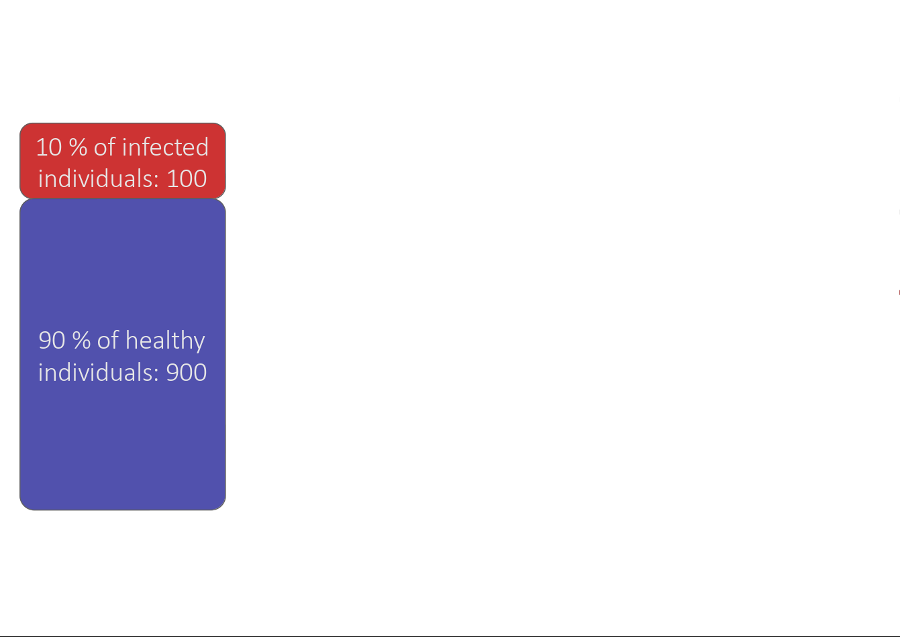
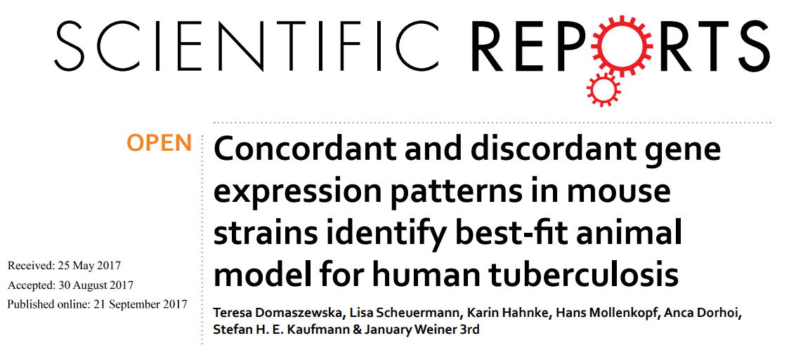

```{r,echo=FALSE}
## Set default options for the knitr RMD processing
knitr::opts_chunk$set(echo=FALSE,warning=FALSE,message=FALSE,fig.width=5,fig.height=5,cache=FALSE,autodep=TRUE, results="hide")
library(pander)
library(knitr)
library(kableExtra)
```

```{r echo=FALSE,include=FALSE,eval=TRUE}
options(crayon.enabled = TRUE)
options(crayon.colors = 256)
knitr::knit_hooks$set(output = function(x, options){
  paste0(
    '<pre class="r-output"><code>',
    fansi::sgr_to_html(x = htmltools::htmlEscape(x), warn = FALSE),
    '</code></pre>'
  )
})

## this is an ugly, ugly hack, but otherwise crayon does not LISTEN TO REASON!!!
num_colors <- function(forget=TRUE) 256
library(crayon)
assignInNamespace("num_colors", num_colors, pos="package:crayon")
```


```{r libraries,cache=FALSE}
library(tidyverse)
```

---

## Reproducibility crisis in science


.myfootnote[
*Fanelli D. Opinion: Is science really facing a reproducibility crisis, and
do we need it to?. Proceedings of the National Academy of Sciences. 2018
Mar 13;115(11):2628-31.*
]

---

## Reproducibility crisis in science


.myfootnote[
*Open Science Collaboration. "Estimating the reproducibility of
psychological science." Science 349.6251 (2015).*
]

---

## Reproducibility crisis in science


.myfootnote[
*Perrin, Steve. "Preclinical research: Make mouse studies work." Nature
News 507.7493 (2014): 423.*
]

---

## Reproducibility crisis in science


.myfootnote[
*Ioannidis JP. Why most published research findings are false. PLoS medicine. 2005 Aug 30;2(8):e124.*
]

---


## Reasons for the reproducibility crisis: Money

.center[

]

---

## Reasons for the reproducibility crisis: Hype


---

## Reproducibility crisis in science

```{r results="markdown"}
require(tidyverse)
df <- read.delim(text='
"Journal impact factor"\tNumber of articles\tMean number of citations of non-reproduced articles*\tMean number of citations of reproduced articles
>20\t21\t248 (range 3–800)\t231 (range 82–519)
5–19\t32\t169 (range 6–1,909)\t13 (range 3–24)', sep="\t")
colnames(df) <- gsub("\\.", " ", colnames(df))
knitr::kable(df)
```

Bottom line: non-reproducible papers are more highly cited!

.myfootnote[
*Begley CG, Ellis LM. Raise standards for preclinical cancer research.
Nature. 2012 Mar;483(7391):531-3.*
]

---

## Reasons for the reproducibility crisis:<br>Misunderstanding and misusing of statistics

.center[


]

---

## Reasons for the reproducibility crisis:<br>Misunderstanding and misusing of statistics

--

 * file drawer (suppresing non-significant results)

--

 * HARKing: Hypothesis After Results are Known

--

 * p-hacking / fishing / "researchers degrees of freedom"

--

 * "Garden of forking paths" (Gelman)


---

## Misunderstanding the p-values

What is a p-value?


---

## Cherry-picking and p-hacking 

---
class:empty-slide,myinverse
background-image:url(images/torturedata.jpg)

???

Stanisław Lem: "From strawberries under torture one may extract all sorts of
things."

---
class:empty-slide,myinverse
background-image:url(images/vonneumann.jpg)

---

## Music makes people literally younger

"*[W]e asked 20 University of Pennsylvania undergraduates to listen to
either “When I’m Sixty-Four” by The Beatles or “Kalimba.” Then, in an
ostensibly unrelated task, they indicated their birth date (mm/dd/yyyy) and
their father’s age. We used father’s age to control for variation in
baseline age across participants*.

*An ANCOVA revealed the predicted effect: According to their birth dates,
**people were nearly a year-and-a-half younger after listening to “When I’m
Sixty-Four” (adjusted M = 20.1 years) rather than to “Kalimba” (adjusted M
= 21.5 years), F(1, 17) = 4.92, p = .040**.*"

.myfootnote[ 
*Simmons JP, Nelson LD, Simonsohn U. False-positive
psychology: Undisclosed flexibility in data collection and analysis allows
presenting anything as significant. Psychological science. 2011
Nov;22(11):1359-66.* 
]


---


## A short guide to p-hacking

 * p > 0.05? Try another test
 * Or maybe add or remove some covariates?
 * Surely, there are outliers. Remove them.
 * Well, let us collect some more data. And then some more. As long as it
   takes.


---

## Evidence for p-hacking: the p-curve

.pull-left[

]

.myfootnote[
left: *Head ML, Holman L, Lanfear R, Kahn AT, Jennions MD. The extent and
consequences of p-hacking in science. PLoS Biol. 2015 Mar
13;13(3):e1002106.*

right: *Masicampo EJ, Lalande DR. A peculiar prevalence of p values just below 0.05. 
Quarterly journal of experimental psychology. 2012 Nov;65(11):2271-9.*

]


--

.pull-right[

]


---

## Reasons for the reproducibility crisis: Lack of transparcency

.pull-left[

]

.pull-right[
"*We requested just the images of western blotting membranes and I wonder
how such images can contain novel information that is worth being kept
confidential.*"
]


.myfootnote[
*Miyakawa, Tsuyoshi. "No raw data, no science: another possible source of
the reproducibility crisis." (2020). Molecular Brain 13:24.*
]

---

## Reasons for the reproducibility crisis: Lack of transparcency

 * no precise description of methods:

```
We used generalized linear models (R package nlme4) to test the
significance of association.
```

Fine, but how exactly was the model formulated? How many covariates? What
transformations? What data were used? Which function? Were the results
corrected for multiple testing? Etc., etc., etc.

---

## Lack of transparency leads to different results


---

## p = 0.05

 * Arbitrary threshold introduced (mostly) by R.A. Fisher
 * In perfect circumstances, guarantees a false positive rate of 1 in 20

```
Q: Why do so many colleges and grad schools teach p = 0.05?

A: Because that's still what the scientific community and journal editors use.

Q: Why do so many people still use p = 0.05?

A: Because that's what they were taught in college or grad school.
```

*Wasserstein, Ronald L., and Nicole A. Lazar. "The ASA's statement on p-values: context, process, and purpose." The American Statistician (2016).*

---

## Is p = 0.05 enough?

Consider a test for a disease (like a test for Sars-Cov-2 infection). 

 * Sensitivity 80%: that is, no more than 20% False Negatives (FNs)
 * Specificity 95%: no more than 5% False Positives (FPs)

Imagine you are tested and that the result is positive. What is the
probability that you are infected with Sars-Cov-2?


(**Note:** in reality, the Sars-Cov-2 tests are *much* more sensitive and
specific)

---

## Is p = 0.05 enough?



---

## Is p = 0.05 enough?


---

## Is p = 0.05 enough?


---

## Is p = 0.05 enough?

OK, now replace "Sars-Cov-2 test" with "hypothesis test".

 * 80% sensitivity is normal for statistical tests (80% power)

 * 95% specificity corresponds to our p = 0.05

How many (scientific) hypotheses we are testing are really correct?

 * Surely much less than 100%, if it was close to 100% we would not be using
   statistics!
 * But more than 0%, we would not be doing science otherwise
 * Say, it is 10% (maybe 30% on a good day, but maybe 1% on a bad one).

---

## Is p = 0.05 enough?


---

.center[
```{r fig.width=15,fig.height=8}
require(ggplot2)
require(cowplot)
## proportion of true H1
N     <- 1000
pH1   <- seq(0.0001, 1, length.out=100)
power <- .8
FPR05   <- 1 - pH1 * power / (pH1 * power + (1-pH1) * .05)
FPR005  <- 1 - pH1 * power / (pH1 * power + (1-pH1) * .005)
FPR0005 <- 1 - pH1 * power / (pH1 * power + (1-pH1) * .0005)

df <- data.frame(pH1=rep(pH1, 3), FPR=c(FPR05, FPR005, FPR0005), alpha=rep(c("0.05", "0.005", "0.0005"), each=length(pH1)))
g1 <- ggplot(df, aes(x=pH1, y=FPR, color=alpha)) + geom_line(size=2) + theme_cowplot() + 
  scale_color_brewer(palette="Dark2") + geom_hline(yintercept=0.05) + xlab("Proportion of true H_1") + 
  ylab("Actual False Positive Rate")
g1
```
]

---

.center[
```{r fig.width=15,fig.height=8}
g1 + scale_y_continuous(trans="log10")
```
]


---

## To test or not to test

The conundrum with testing for normality:

 * normality test works in the opposite direction of a regular test: 

    * rejection is the "non-favored" outcome

    * lack of significance "proofs" normality

--

 * if test is underpowered, the data will always appear normal

 * if test is overpowered, the data will *never* appear normal 

 * better: consider your prior (do you have reasons to believe there might
   be an issue with normality?) and use visualization tools / other similar
   data sets


---

.pull-left[
<q>To make the preliminary test on variances [before running a t-test or
ANOVA] is rather like putting to sea in a rowing boat to find out whether
conditions are sufficiently calm for an ocean liner to leave port!</a>

<span style="text-align:right">– George E. P. Box</span>

]

.pull-right[


]


---

## Multiple testing

 * Every time you run a statistical test, you have a chance of fooling
   yourself
 
 * In bioinformatics, running tens of thousands of statistical tests is
   pretty common

---
class:empty-slide,myinverse
background-image:url(images/salmon_1.png)

---

## Multiple testing

.pull-left[
**Subject.** One mature Atlantic Salmon (Salmo salar) participated in the fMRI study.
The salmon was approximately 18 inches long, weighed 3.8 lbs, and was not alive at
the time of scanning.

**Task.** The task administered to the salmon involved completing an open-ended
mentalizing task. The salmon was shown a series of photographs depicting human
individuals in social situations with a specified emotional valence. The salmon was
asked to determine what emotion the individual in the photo must have been
experiencing.
]

.pull-right[


]

---

## Of mice and men


---

.mycenter[

Repeatability,<br>
Replicability,<br>
Reproducibility

]

---

## Of mice and men

.pull-left[

]

.pull-right[

 * No or little correlation between transcriptomic responses in mouse
   models and human models: $r^2 < 0.1$ – less than 10% of variance
   explained

 * No similarity in identified functions
]
 


---

## Of mice and men


--


---

## Of mice and men

.pull-left[

]

.pull-right[

 * Strong correlation between mouse and human transcriptomic responses for
   genes which are regulated in one or the other condition:
   $\rho \geq 0.5$; change direction correlated

 * Similar functions for similarly regulated genes
]
 


---

## Reproducibility, Repeatability, Replicability


 * **Repeatability:** you can repeat your calculations precisely

.myfootnote[
*McArthur SL. Repeatability, Reproducibility, and Replicability: Tackling
the 3R challenge in biointerface science and engineering.*
]
 
--

 * **Replicability:** Others can repeat your calculations precisely.

--

 * **Reproducibility:** Other approaches to the same problem give
   compatible results.

---

## Of mice and men

.pull-left[


]

--

.pull-right[

 * None of the papers was replicable, because precise description of
   methods leading from data to results was missing. 


 * At best, we were able to *roughly* reproduce the results using guesswork
   and custom code


 * How can we hope for *reproducibile* research if we cannot assure
   *replicable* research?

]

---

## Of mice and men (our story)

Hypothesis: "Genomic responses in mouse models *partly* mimic human
inflammatory diseases"

---

## Of mice and men (our story)



.myfootnote[
*Domaszewska T, Scheuermann L, Hahnke K, Mollenkopf H, Dorhoi A, Kaufmann
SH, Weiner J. Concordant and discordant gene expression patterns in mouse
strains identify best-fit animal model for human tuberculosis. Scientific
reports. 2017 Sep 21;7(1):1-3.*
]

---

## Of mice and men (our story)

.pull-left[


]

.pull-right[
  * numbers in the figure show numbers of concordant / discordant gene
    groups
  * 129S2 mice die when infected with *Mycobacterium tuberculosis*. Their
    responses grow more similar to human responses in the course of
    infection and less similar to C57BL/6 mice.
  * C57BL/6 mice survive the infections. The dissimilarity to human
    responses and 129S2 responses decreases over time.
]

---

## Ensuring replicability

Fist circle of hell: providing detailed information on how to replicate
your results.

.pull-left[
"*...I thought it necessary to deliver things circumstantially, that the
person I addressed them to might, without mistake, and with as little
trouble as possible, be able to repeat such unusual experiments*"

*Robert Boyle, 1627-1691*
]

.pull-right[

]


---
class:empty-slide,myinverse
background-image:url(images/data_analysis_scheme.png)


---
class:empty-slide,myinverse
background-image:url(images/data_analysis_scheme_2.png)

---

## Ensuring replicability

 * publish your code

--

 * make sure that the code *starts* with data exactly as it is available
   for your colleagues (no custom Excel files)

--

 * avoid at all costs any operations that can not be written down as code
   (e.g. editing of spreadsheets in Excel *unless* you want to publish the
   edited versions)

--

 * The code should produce output which is as close to the published
   results (figures, tables etc.) as possible.

--

 * Provide generous instructions on how to run your code, which software or
   R packages need to be installed etc. Make it as simple as possible;
   optimally, it should run without problems with a single simple command.

---

## Ensuring replicability

Second circle of hell: providing detailed information on the software you
have used.


---

## Ensuring replicability: `sessionInfo()`

**Always** include `sessionInfo()` at the end of your report.

```{r echo=TRUE}
sessionInfo()
```

---

```{r echo=FALSE,results="markdown"}
options(width=120)
sessionInfo()
```

---

## Ensuring replicability: other software

 * If possible, use an automated system to include the software version you
   use

--

The following code runs the NCBI program `blastp` with the option
`-version` and captures the output of the program in the variable
`blastp_version`.

```{r echo=TRUE,results="markdown"}
## running in R, so we can include it in Rmarkdown
blastp_version <- system2("blastp", "-version", stdout=TRUE)
blastp_version <- blastp_version[2]
```

--

Then, one can use it directly in Rmarkdown:

```
To search for similar amino acid sequences, we have used the BLASTP program
included in the BLAST package ( ` r blastp_version ` ).
```


--

Output:

To search for similar amino acid sequences, we have used the BLASTP program
included in the BLAST package (`r blastp_version`).

---

## Ensuring replicability

Further five circles of hell: actually making sure that your software will
run.

 * Package versions behave differently and produce different output
 * Even different versions of R may produce different output

--

Solution: 

 * Use a VM / Container / Environment to freeze the state of the software
   (program versions, options etc.)
 * Major downside: takes up a lot of space
 

---

## Ensuring replicability: VMs


Virtual Machines: all software including OS in a single file which can be
moved, archived and "executed". It will freeze the state of every single
component of your analysis pipeline. 

--


E.g. Oracle VM [VirtualBox](https://www.virtualbox.org/) – free, available for Windows, MacOS and Linux,
can run any guest-OS on any host-OS (e.g. Windows on Linux, or Linux on
MacOS etc.).

Windows Substem Linux (WSL) on Windows.

--

.pull-left[
Advantages:

 * portable
 * easy to use
 * ensures 100% software identity
]

.pull-right[
Downsides: 

 * huge performance penalty 
 * images may include proprietary software (e.g. Windows OS), and often cannot be freely published.
]

---
class:empty-slide,myinverse
background-image:url(images/vbox.png)

---

## Ensuring replicability: Containers

Containers: very similar to VM, but do not actually run a virtual
machine. Instead, they depend on the host OS to run your code, but all
software / libraries are contained in the container.


E.g. [Singularity](https://sylabs.io/guides/3.0/user-guide/index.html) (runs on Linux only)

.pull-left[
Advantages:

 * no performance hit
 * portable
 * efficient
 * have many more applications (ensuring portability)
]

.pull-right[
Downsides:

 * much harder to use
 * command-line only
 * basically Linux (running on Windows / MacOS using a VM with Linux)
]

---

## Ensuring replicability: Environments

Environments: lightweight approach to containers. Not all software is
really contained, and the integration (e.g. choosing which software version
to run) happens over environmental variables. 


E.g. [Anaconda](https://www.anaconda.com/): Python-based, works on Linux, MacOS, Windows. Software
packages can be specified with a simple text file, versions can be
selected. The environment is stored in a user directory tree.

--

.pull-left[
Advantages:
 
 * relatively easier to use
 * repeatability: +
 * can be used to describe the installed environment in much detail but in
   a simple text file

]

.pull-right[
Downsides:

 * portability-, replicability- (compared to containers / VMs)
 * package dependency hell
 * package availability might be limited
]


---

## Reproducible bioinformatic analyses with R

.pull-left[

]

.pull-right[

 * Writing reproducible and communicative analyses

 * Using markdown for your everyday needs
 
 * Tools for transparent and reproducible research (git, github, pipelines, containers)

 * Get a jump start on R – which makes reproducible research much easier
   and is a great statistical analysis language

]


---

## Why learn reproducible science with R?

 * Easy to document your statistical procedures

--

 * Harder to hide harking, p-hacking and file drawer

--

 * One way or the other, you will have to learn it


