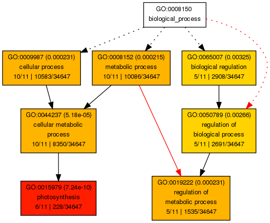
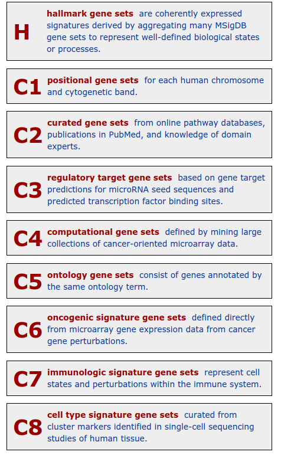
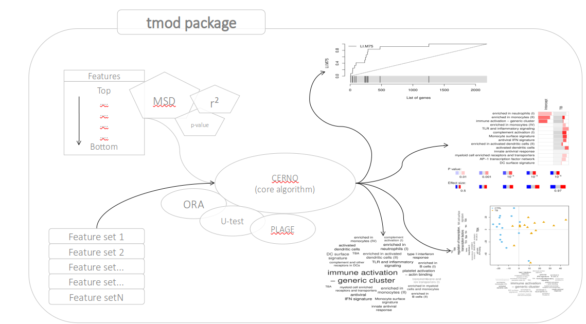
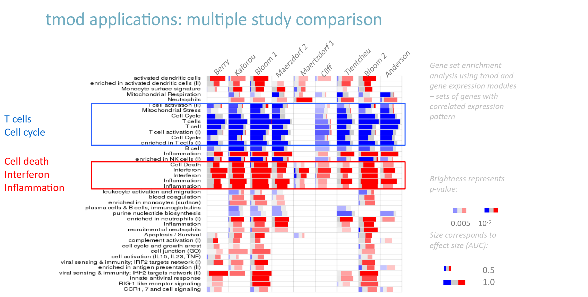
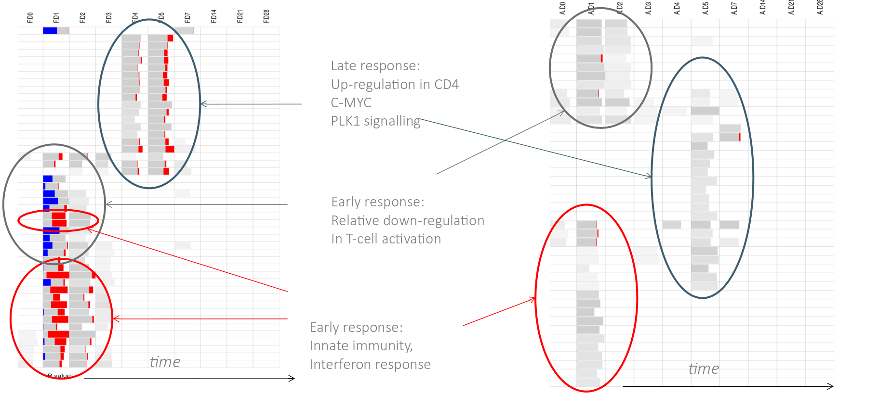
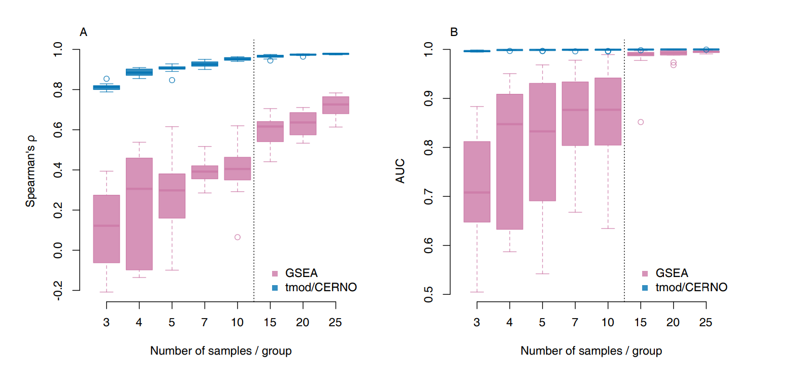
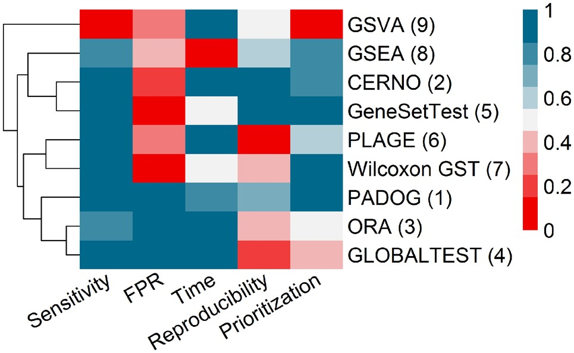
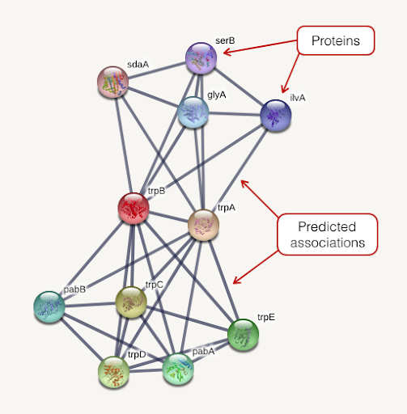

```{r,echo=FALSE}
## Set default options for the knitr RMD processing
knitr::opts_chunk$set(echo=FALSE,warning=FALSE,message=FALSE,dev="svg",fig.width=5,fig.height=5,cache=FALSE,autodep=TRUE, results="hide")
library(pander)
library(knitr)
library(kableExtra)
```

```{r echo=FALSE,include=FALSE,eval=TRUE}
options(crayon.enabled = TRUE)
options(crayon.colors = 256)
knitr::knit_hooks$set(output = function(x, options){
  paste0(
    '<pre class="r-output"><code>',
    fansi::sgr_to_html(x = htmltools::htmlEscape(x), warn = FALSE),
    '</code></pre>'
  )
})

## this is an ugly, ugly hack, but otherwise crayon does not LISTEN TO REASON!!!
num_colors <- function(forget=TRUE) 256
library(crayon)
assignInNamespace("num_colors", num_colors, pos="package:crayon")
```

```{r libraries,cache=FALSE}
library(tidyverse)
library(ggplot2)
library(readxl)
library(cowplot)
library(RColorBrewer)
library(cluster)
library(pca3d)
library(Rseasnap)
library(colorDF)
library(DESeq2)
library(tmod)
library(edgeR)
library(broom)
```

```{r options}
library(ggthemes)
theme_set(theme_tufte())
```


<!--
class:empty-slide,myinverse
background-image:url(images/arnolfini.jpg)
-->


---

## Gene set enrichment analysis

```{r cache=TRUE}
covar <- readRDS("../../Datasets/covar.rds")
cnts  <- readRDS("../../Datasets/counts.rds")
annot <- readRDS("../../Datasets/annot.rds")
lcpm  <- cpm(cnts, log=TRUE)
```

```{r deseq2,cache=TRUE}
library(DESeq2)
ds2 <- DESeqDataSetFromMatrix(countData = cnts, colData=covar, design = ~group)
ds2 <- DESeq(ds2)
res <- map(rlang::set_names(resultsNames(ds2)), ~ results(ds2, name=.x))
```

The problem: how do you interpret a list of 1000 results?

---

```{r results="asis"}
res <- map(res, ~ .x %>% as.data.frame %>% { merge(annot, ., by.x="PrimaryID", by.y=0)} %>% arrange(padj))
DT::datatable(res[[2]] %>% dplyr::slice(1:100) %>% select(SYMBOL, GENENAME, log2FoldChange, padj)) %>%
  DT::formatSignif(c("log2FoldChange", "padj"), digits=2)
```

Total results: `r sum(res[[2]]$padj < 0.05 & abs(res[[2]]$log2FoldChange) > 1)` 
(at $p < 0.05$ and $\log_2(FC) > 1$ )

---

## A few examples

```{r fig.width=14,fig.height=6.5,dev="svg"}
g1 <- plot_gene_generic( "ENSG00000111335", "disease_state", lcpm, covar, annot=res[[2]])
g2 <- plot_gene_generic( "ENSG00000185745", "disease_state", lcpm, covar, annot=res[[2]])
g3 <- plot_gene_generic( "ENSG00000137959", "disease_state", lcpm, covar, annot=res[[2]])
g4 <- plot_gene_generic( "ENSG00000105939", "disease_state", lcpm, covar, annot=res[[2]])
plot_grid(g1, g2, g3, g4, ncol=2)
```

???

OAS2: by creating oligomers of ATP, induces RNASEL

IFIT1: binds to PPP-RNA, acting as a sensor to viral RNA

IFI44L: negative feedback – lowers the interferon response

ZC3HAV1, aka ZAP (zinc finger antiviral protein), Viruses comprised a unique ZRE, such as MLVs, SINV, Ebola virus, HIV-1, and hepatitis B virus, are susceptible to ZC3HAV1

---

.mycenter[
Basic idea behind gene set enrichments:<br>
categorize genes
]


---
class:empty-slide,myinverse
background-image:url(images/desert2.jpg)

.mytop[
The number of grains of sand in this picture accurately represents the
number of approaches for functional analysis of gene expression.
]

---

## Gene ontology database

.pull-left[

 * Genes are assigned to GO categories
 * GO categories are assigned to each other
 * GO can be represented as a *directed acyclic graph*

]

.pull-right[

]

---

## KEGG pathways

KEGG – Kyoto Encyclopaedia of Genes and Genomes

---
class:empty-slide,myinverse
background-image:url(images/hsa04110.gse16873.png)

---


## Other gene sets

Different lists of genes can be obtained from various sources.

 * Coexpression data sets: groups of genes that have correlated expression
   profiles

--

 * Results from another differential gene expression analysis experiment:
   groups of genes significant in a comparison

--

 * Targets of a particular miRNA determined computationally


---

## MSigDB – a meta database of gene sets

.pull-left[

]

.pull-right[

(very) Important sets:

 * **Hallmark:** 50 manually selected gene sets
 * **C2:** Kegg, Reactome, Wikipathways, Biocarta
 * **C5:** Gene Ontology (GO)
]

---

## Group of genes, and then what?

**Question:** are genes from a gene set $S$ more likely to be
differentially expressed than other genes?

--

 Gene set enrichment analysis:

 * 1st generation: hypergeometric test, Fisher's exact test
 * 2nd generation: other algorithms, often relying on ordering the list of
   genes
 * 3rd generation: pathway topology analysis


---

## Generation 1: 

First, define DEGs: differentially expressed genes (e.g.
$|\log_2(FC)| > 1$, $q < 0.001$)

Second, define which genes are in a given gene set (GS), and which are not.

.pull-left[

**No significant enrichment:**

|    |DEGs |non-DEGs|Fraction|
|----|-----|--------|--------|
|in GS|5 | 95| 5%|
|non in GS|50 |1000|5%|
|Fraction|9%|9.5%||

]

--

.pull-right[


**Significant enrichment:**

|    |DEGs |non-DEGs|Fraction|
|----|-----|--------|--------|
|in GS|50 | 60| 45%|
|non in GS|70 |1000|7%|
|Fraction|42%|6%||

]

How can we test it?

---

.pull-left[

**No significant enrichment:**

|    |DEGs |non-DEGs|Fraction|
|----|-----|--------|--------|
|in GS|5 | 95| 5%|
|non in GS|50 |1000|5%|
|Fraction|9%|9.5%||

]

.pull-right[


**Significant enrichment:**

|    |DEGs |non-DEGs|Fraction|
|----|-----|--------|--------|
|in GS|50 | 60| 45%|
|non in GS|70 |1000|7%|
|Fraction|42%|6%||

]

--

.pull-left[
Results of $\chi^2$ test:

```{r, results="markdown"}
chisq.test(matrix(c(5, 95, 50, 1000), byrow=TRUE, nrow=2)) %>% tidy() %>%
  kable()
```

]

--

.pull-right[


Results of $\chi^2$ test:


```{r, results="markdown"}
chisq.test(matrix(c(50, 60, 70, 1000), byrow=TRUE, nrow=2)) %>% tidy() %>%
  kable()
```

]

---

## Effect size in ORA

Given gene set $S$, we can define enrichment $E$ as following odds ratio:

 $$E =  \frac{\frac{b}{n}}{\frac{B}{N}} = \frac{b}{B} \cdot \frac{N}{n}$$

where

 * $b$ – number of DEGs in $S$
 * $n$ - number of DEGs
 * $B$ - number of genes in $S$
 * $N$ – number of genes

(actually, we should use $B-b$ and $N-n$ for odds ratio)

---

## Example results 

For DEG defined with $q < 0.001$, $|\log_2(FC)| > 1$

```{r results="markdown"}
fg <- res[[2]] %>% filter(padj < 0.001 & abs(log2FoldChange) > 1) %>%
  pull(SYMBOL)

ora_res <- tmodHGtest(fg=fg, bg=res[[2]]$SYMBOL)
DT::datatable(ora_res %>% select(ID, Title, b, B, n, N, E, adj.P.Val),
              options=list(pageLength=5)) %>%
  DT::formatSignif(c("adj.P.Val", "E"), digits=2)
```


---

## Disadvantages of the generation 1 approach

 * You have to define DEGs... but that depends on the number of samples

    * the larger the number of samples, the higher statistical power
    * the higher statistical power, the more DEGs you can detect
    * therefore, the results depend on an arbitrary threshold

 * What if you have no DEGs at all?


---
class:empty-slide,myinverse
background-image:url(images/img21.png)

---

## Generation 2 approaches – "Functional Class Sorting"

 * do not depend on arbitrary thresholds

---

## tmod algorithm

 * Arrange the genes according to p-value or another similar metrics
 * Test whether genes from a given gene set are denser on the beginning of
   the list

---
class:empty-slide,myinverse
background-image:url(images/img22.png)

---
class:empty-slide,myinverse
background-image:url(images/img23.png)

---
class:empty-slide,myinverse
background-image:url(images/img24.png)

---
class:empty-slide,myinverse
background-image:url(images/img25.png)

---
class:empty-slide,myinverse
background-image:url(images/img26.png)

---
class:empty-slide,myinverse
background-image:url(images/img27.png)

---
class:empty-slide,myinverse
background-image:url(images/img28.png)

---

### Tmod statistics

Since normalized ranking for a gene $i$

$r'_{i}=\frac{r_i}{N} \sim U(0,1)$

--

then

$-\ln{r'_{i}} \sim Exp(1)$

--

and

$-2\cdot\ln{r'_i} \sim \chi^2_2$

--

thus, if $G$ is a set of genes,

$-2\cdot\sum_{i \in G}\ln{r'_i} \sim \sum_{i \in G}\chi^2_2 \sim \chi^2_{2\cdot n(G)}$

This gives a fast and reliable statistics with a known distribution which
can be used to associate a p-value to any set of genes.


---



.footnote[*Zyla J, Marczyk M, Domaszewska T, Kaufmann SH, Polanska J, Weiner
3rd J. Gene set enrichment for reproducible science: comparison of CERNO
and eight other algorithms. Bioinformatics. 2019 Dec 15;35(24):5146-54.*]

---



---



.pull-left[Vaccine with an adjuvant]

.pull-right[Vaccine without an adjuvant]

.footnote[*Weiner, January, et al. "Characterization of potential biomarkers
of reactogenicity of licensed antiviral vaccines: randomized controlled
clinical trials conducted by the BIOVACSAFE consortium." Scientific reports
9.1 (2019): 1-14.*]

---

## Results in our data set

```{r results="markdown"}
tmod_res <- tmodCERNOtest(res[[2]] %>% pull(SYMBOL))

DT::datatable(tmod_res %>% select(ID, Title, N1, AUC, adj.P.Val),
              options=list(pageLength=8)) %>%
  DT::formatSignif(c("adj.P.Val", "AUC"), digits=2)
```

---

## Comparison with the ORA results

```{r fig.width=10,fig.height=5}
foo <- merge(ora_res, tmod_res, by="ID")
g1 <- ggplot(foo, aes(x=-log10(adj.P.Val.x), y=-log10(adj.P.Val.y))) + geom_point() +
  geom_abline(slope=1, intercept=0) +
  ggtitle("-log10(p-value)") + xlab("ORA") + ylab("tmod")
g2 <- ggplot(foo, aes(x=E, y=AUC)) + geom_point() +
  geom_abline(slope=1, intercept=0) +
  ggtitle("E vs AUC") + xlab("ORA") + ylab("tmod")
plot_grid(g1, g2)
```


---

## Effect sizes in tmod

.pull-left[

Leukocyte activation and migration: 11 genes, strongly enriched; $AUC = 0.89$, $p < 10^{-3}$.

```{r fig.height=4.5}
evidencePlot(l = res[[2]]$SYMBOL, m="LI.M38", gene.labels = TRUE)
```

]

.pull-right[

Regulation of antigen presentation and immune response: 77 genes, weakly
enriched; $AUC = 0.67$, $p < 10^{-5}$.

```{r fig.height=4.5}
evidencePlot(l = res[[2]]$SYMBOL, m="LI.M5.0")
```

]


---

## GSEA algorithm

.pull-left[


]

.pull-right[

**In short:**

 * Kolmogorov-Smirnof-like statistic
 * No analytical solution:
   * Good: does not make assumption of independence
   * Bad: requires randomization
   * Ugly: many implementations resample the genes rather than samples
     $\rightarrow$ assumption of independence again (including original
     algorithm for sample sizes < 15)
 * Really dumb name

]


---



Different sample sizes were compared to the original output of each
program. *Left*, Spearman correlation of the p-values from the respective result
lists. Right, AUC (recovered gene sets compared to the original output).
GSEA stability breaks down under 15 samples, where gene-based randomization
is used.

.myfootnote[
*Weiner 3rd, January, and Teresa Domaszewska. "tmod: an R package for general and multivariate enrichment analysis." PeerJ Preprints 4 (2016).*
]

---

## Other algorithms

 * PLAGE: for each gene set, calculate a "module eigengene" – 1st component
   of a PCA. Use this instead of expression to test differences between
   groups.
 * PADOG: weight the genes by how "specific" they are for a gene set, i.e.
   genes present in multiple gene sets matter less than genes present in a
   single gene set. Also a randomization based method.
 * geneSetTest and wilcoxonGST (limma): based on gene-wise permutation.

---



.myfootnote[
*Zyla, Joanna, et al. "Gene set enrichment for reproducible science: comparison of CERNO and eight other algorithms." Bioinformatics 35.24 (2019): 5146-5154.*

]


---

## Network analysis (generation 3)

Genes / proteins may be linked by

 * co-expression 
 * common pathways
 * literature (co-citation)
 * synteny (co-occurence in genomes)
 * common motifs

---

## STRING




---

```{r}
ds <- disco_score(res[[2]], res[[3]], by="PrimaryID")
```


## DISCO: *Discordance* / *concordance* analysis

**Concordant genes:** genes which behave similarly in a comparison.

**Discordant genes:** genes that behave differently in a comparison.

.pull-left[

**Concordant:**

```{r fig.height=4,fig.width=5}
plot_gene_generic( "ENSG00000108700", "disease_state", lcpm, covar, annot=res[[2]])
```

]

--

.pull-right[

**Discordant:**

```{r fig.height=4,fig.width=5}
plot_gene_generic( "ENSG00000122861", "disease_state", lcpm, covar, annot=res[[2]])
```


]

---

## DISCO statistics

The idea: include *both* effect size and p-value in the calculation of the
statistic. The sign should reflect the concordance: 
 * positive values for concordant genes, 
 * negative values for discordant genes.

 $$\log_2(FC_1) \cdot \log_2(FC_2) \cdot -(\log_{10}(p_1) + \log_{10}(p_2))$$


---

## DISCO plots

.center[

```{r}
g <- plot_disco(res[[2]], res[[3]], by="PrimaryID")
g + xlab(names(res)[2]) + ylab(names(res)[3])
```

]

---

### DISCO + tmod

```{r, fig.width=10,fig.height=5}
res_conc <- tmodCERNOtest(ds %>% arrange(-disco) %>% pull(SYMBOL.x))
res_disc <- tmodCERNOtest(ds %>% arrange(disco) %>% pull(SYMBOL.x))
res_tm_1 <- list(
               CONC=res_conc %>% arrange(adj.P.Val) %>% dplyr::slice(1:10),
               DISC=res_disc %>% arrange(adj.P.Val) %>% dplyr::slice(1:10))
tmodPanelPlot(res_tm_1, text.cex=.8)
```

---

```{r, fig.width=10,fig.height=5}
res_tm <- list(
               CONC_other=res_conc %>% arrange(adj.P.Val) %>% dplyr::slice(1:10),
               CONC_sc2=res_conc %>% arrange(adj.P.Val) %>% dplyr::slice(1:10),
               DISC_other=res_disc %>% arrange(adj.P.Val) %>% dplyr::slice(1:10),
               DISC_sc2=res_disc %>% arrange(adj.P.Val) %>% dplyr::slice(1:10))
pie <- list(
            CONC_other=tmodDecideTests(g = res[[2]]$SYMBOL, 
                                 lfc = res[[2]]$log2FoldChange,
                                 pval = res[[2]]$padj)[[1]],
            CONC_sc2=tmodDecideTests(g = res[[3]]$SYMBOL, 
                                 lfc = res[[3]]$log2FoldChange,
                                 pval = res[[3]]$padj)[[1]],
            DISC_other=tmodDecideTests(g = res[[2]]$SYMBOL, 
                                 lfc = res[[2]]$log2FoldChange,
                                 pval = res[[2]]$padj)[[1]],
            DISC_sc2=tmodDecideTests(g = res[[3]]$SYMBOL, 
                                 lfc = res[[3]]$log2FoldChange,
                                 pval = res[[3]]$padj)[[1]])


tmodPanelPlot(res_tm, pie=pie, grid="b", text.cex=.8)
```


---

## Concordant gene sets

```{r}
DT::datatable(res_conc %>% select(ID, Title, N1, AUC, adj.P.Val),
              options=list(pageLength=10)) %>%
  DT::formatSignif(c("adj.P.Val", "AUC"), digits=2)
```


---

## Discordant gene sets

```{r}
DT::datatable(res_disc %>% select(ID, Title, N1, AUC, adj.P.Val),
              options=list(pageLength=10)) %>%
  DT::formatSignif(c("adj.P.Val", "AUC"), digits=2)
```


